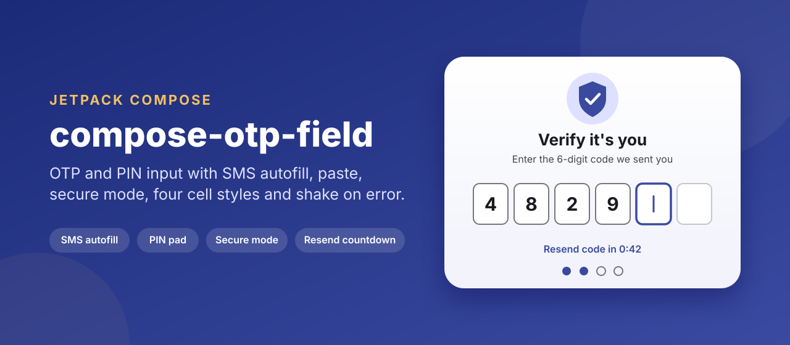
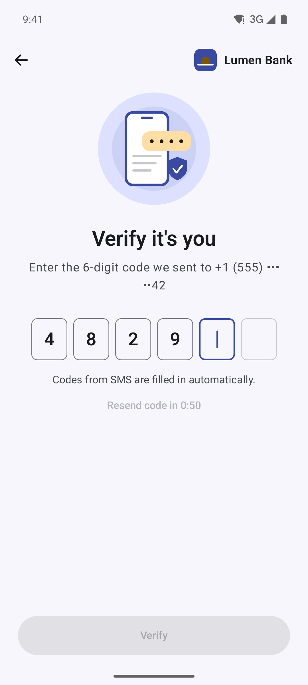
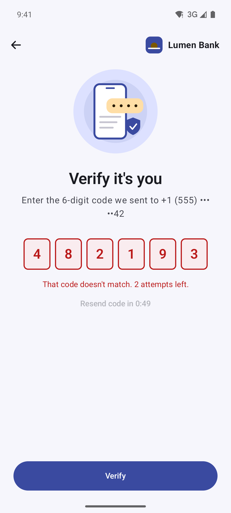
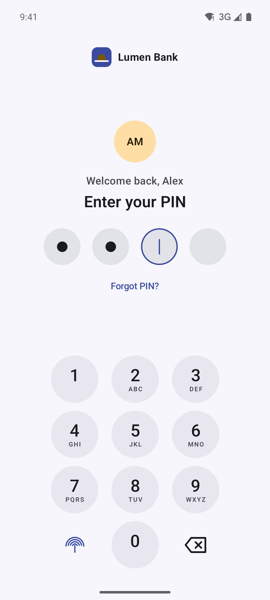
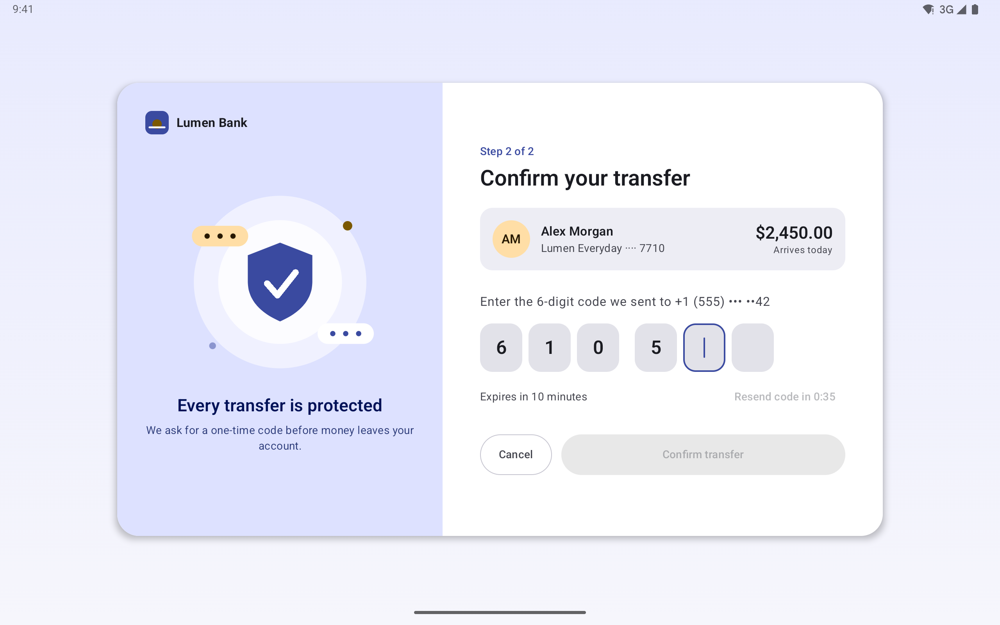
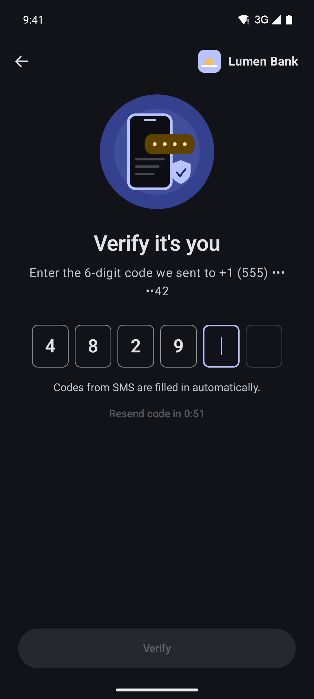
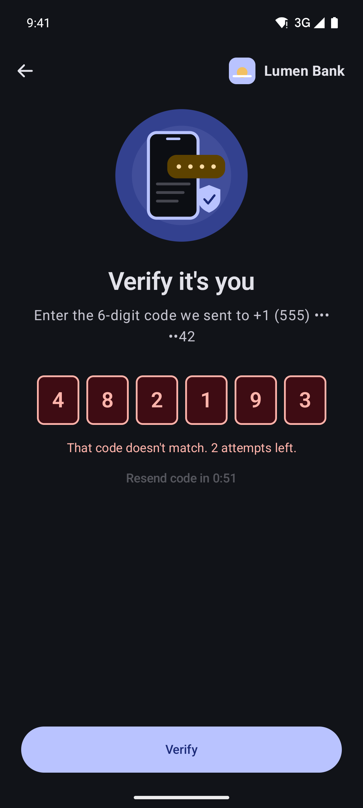
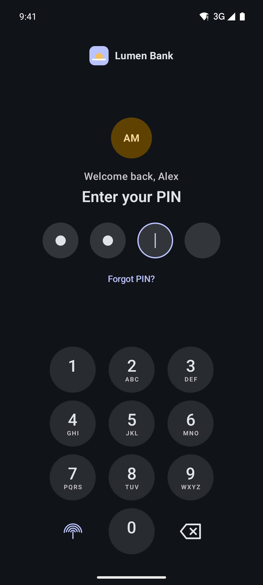
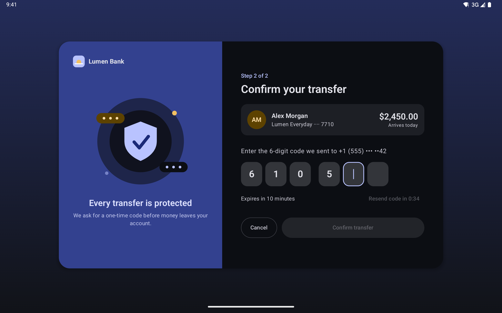

<p align="center">
  
</p>

<p align="center">
  <a href="https://github.com/halilozel1903/compose-otp-field/actions/workflows/ci.yml"></a>
  <a href="https://jitpack.io/#halilozel1903/compose-otp-field"></a>
  
  
  
  
  <a href="LICENSE"></a>
</p>

**compose-otp-field** is a one-time code and PIN input for Jetpack Compose. `OtpField` draws one cell per character on top of a single hidden text field, so the keyboard, SMS autofill, the keyboard's code suggestion and TalkBack all see one ordinary field. Pasted codes are cleaned up (`482-913`, `482 913` and full-width `４８２９１３` all become `482913`), backspace and taps work per cell, wrong codes shake the field with a haptic, and secure mode shows dots with the last digit revealed for a moment. It comes with a `PinPad` keypad, a `ResendCodeButton` with a countdown, an optional SMS User Consent helper and a small pure Kotlin core with unit tests.

```kotlin
var code by rememberSaveable { mutableStateOf("") }

OtpField(
    value = code,
    onValueChange = { code = it },
    length = 6,
    style = OtpFieldDefaults.boxed(),
    isError = wrongCode,                 // red cells, shake and a reject haptic
    onComplete = { viewModel.verify(it) },
)
```

## Screenshots

Captured from the sample app (Lumen Bank, a fictional bank) on Android emulators by CI.

| Code entry | Wrong code | PIN with keypad |
| :---: | :---: | :---: |
|  |  |  |

**Tablet:** the transfer confirmation card with an illustration, the rounded style and the code in two groups of three.



| Code entry, dark | Wrong code, dark | PIN, dark | Tablet, dark |
| :---: | :---: | :---: | :---: |
|  |  |  |  |

## Features

- **One hidden text field**: built on `BasicTextField` with a `TextFieldState`; the cells are drawn, so IME, autofill and accessibility behave like a normal field (secure codes are reported as passwords).
- **Four styles**: `boxed`, `rounded`, `underline` and `circle`, with your own colors, sizes, spacing, corner radius, placeholder character and grouping (`123 456`). Cells shrink evenly when the field gets less width than it needs.
- **Paste that works**: from the keyboard's clipboard chip, from autofill, or with a long press on a cell. Spaces and dashes are stripped, any Unicode digit is converted to ASCII, and the code fills from the active cell; a full-length paste replaces the whole code.
- **Per-cell editing**: typing writes at the active cell, backspace clears the active cell or moves back, tapping a filled cell selects it to overwrite.
- **SMS**: `ContentType.SmsOtpCode` for autofill services and the keyboard's code suggestion, plus `rememberSmsRetriever` for the SMS User Consent API (optional, no SMS permission).
- **Secure mode**: dots instead of characters, the last typed character shown for a moment.
- **Error state**: error colors, a shake animation and a reject haptic each time `isError` turns on.
- **Focus and cursor**: animated border on the active cell, a blinking cursor, characters that pop in.
- **`PinPad`**: a numeric keypad with letters, haptics, a long-press-to-clear backspace, a slot for a biometrics key and an optional shuffled layout.
- **`ResendCodeButton`**: "Resend code in 0:42", then "Resend code", with a resend limit; the countdown survives rotation and process death.
- **Pure Kotlin core** (`compose-otp-field-core`): normalization, paste and backspace rules, SMS code extraction with a configurable regex, resend countdown and attempt limiting with an injected clock. Unit tested.
- **Lightweight**: Compose UI, Foundation, Material 3 (default colors and the resend button) and `activity-compose`. Google Play services is only used when you add it.

## Installation

Add JitPack to `settings.gradle.kts`:

```kotlin
dependencyResolutionManagement {
    repositories {
        google()
        mavenCentral()
        maven("https://jitpack.io")
    }
}
```

Then the dependency:

```kotlin
dependencies {
    implementation("com.github.halilozel1903.compose-otp-field:compose-otp-field:1.0.0")

    // Optional: lets rememberSmsRetriever read the code from an SMS with the user's consent.
    implementation("com.google.android.gms:play-services-auth-api-phone:18.1.0")

    // Pure Kotlin logic only (normalization, SMS code extraction, countdown, attempt limits):
    // implementation("com.github.halilozel1903.compose-otp-field:compose-otp-field-core:1.0.0")
}
```

> The build is also set up for Maven Central (`io.github.halilozel1903:compose-otp-field`) via the vanniktech publish plugin.

## Usage

**Styles**

```kotlin
OtpField(value = code, onValueChange = { code = it }, style = OtpFieldDefaults.boxed())
OtpField(value = code, onValueChange = { code = it }, style = OtpFieldDefaults.rounded())
OtpField(value = code, onValueChange = { code = it }, style = OtpFieldDefaults.underline())
OtpField(value = code, onValueChange = { code = it }, style = OtpFieldDefaults.circle())

// Change anything with copy: sizes, groups, a placeholder, colors.
OtpField(
    value = code,
    onValueChange = { code = it },
    style = OtpFieldDefaults.rounded().copy(
        groupSize = 3,                       // 123 456
        cellWidth = 54.dp,
        cellHeight = 62.dp,
        placeholder = '•',
        colors = OtpFieldDefaults.colors(focusedBorder = Color(0xFF3A4AA0)),
    ),
)
```

**Letters and digits**

```kotlin
OtpField(
    value = code,
    onValueChange = { code = it },
    length = 8,
    charset = OtpCharset.Alphanumeric,   // uppercased; "ab-12" pastes as "AB12"
)
```

**Wrong code**

```kotlin
var code by rememberSaveable { mutableStateOf("") }
var wrong by remember { mutableStateOf(false) }

OtpField(
    value = code,
    onValueChange = { code = it; wrong = false },
    isError = wrong,                     // shakes and buzzes each time it turns true
    onComplete = { wrong = it != expected },
)
```

**PIN with the keypad**

```kotlin
var pin by rememberSaveable { mutableStateOf("") }

OtpField(
    value = pin,
    onValueChange = { pin = it },
    length = 4,
    style = OtpFieldDefaults.circle(),
    secure = true,                       // dots; the last digit shows for 800 ms
    readOnly = true,                     // no system keyboard
    showCursorWithoutFocus = true,       // highlight the next cell anyway
)
PinPad(
    onDigit = { if (pin.length < 4) pin += it },
    onBackspace = { pin = pin.dropLast(1) },
    onBackspaceLongPress = { pin = "" },
    bottomStart = { BiometricsButton() },
    // digits = PinPadLayout.shuffled(),  // scrambled keypad
)
```

**Resend countdown**

```kotlin
val timer = rememberResendTimer(durationSeconds = 60, maxResends = 3)

ResendCodeButton(
    state = timer,
    onResend = { viewModel.sendCode() },
    countdownText = { "Resend code in $it" },
)
// timer.remainingSeconds, timer.canResend, timer.resendsLeft, timer.label ("0:42")
```

**SMS**

`OtpField` marks itself as an SMS one-time code field (`ContentType.SmsOtpCode`), so autofill services and the keyboard's suggestion strip can fill it without any code from you.

To read the code directly from the SMS, add `play-services-auth-api-phone` (see Installation) and use `rememberSmsRetriever`. It uses the [SMS User Consent API](https://developers.google.com/identity/sms-retriever/user-consent/overview): when a message with a code arrives, Android asks the user once whether the app may read it. No SMS permission is needed, and without the dependency or Google Play services it simply does nothing.

```kotlin
val sms = rememberSmsRetriever(
    onCode = { code = it },
    length = 6,
    senderPhoneNumber = null,            // or only messages from this number
)
ResendCodeButton(timer, onResend = { viewModel.sendCode(); sms.restart() })
```

Pass `extractor = OtpCodeExtractor(OtpFormat(6), Regex("""Lumen code: (\d{6})"""))` for your own message format.

**All `OtpField` parameters**

| Parameter | Default | What it does |
| --- | --- | --- |
| `value`, `onValueChange` | | The code and its updates |
| `length` | `6` | Number of cells |
| `style` | `OtpFieldDefaults.boxed()` | Shape, colors, sizes, spacing, groups, placeholder |
| `charset` | `Digits` | `Digits` or `Alphanumeric` |
| `secure` | `false` | Dots instead of characters |
| `isError` | `false` | Error colors, shake and haptic |
| `enabled`, `readOnly` | `true`, `false` | `readOnly` keeps the system keyboard away (for `PinPad`) |
| `autoFocus` | `false` | Focus and open the keyboard on first composition |
| `autofill` | `true` | `ContentType.SmsOtpCode` for autofill |
| `onComplete` | `null` | Called when an edit fills the last cell |
| `revealMillis` | `800` | How long secure mode shows the last character |
| `blinkCursor`, `showCursorWithoutFocus` | `true`, `false` | Cursor behavior |
| `hapticOnError` | `true` | Reject haptic when `isError` turns on |
| `pasteLabel`, `contentDescription`, `errorDescription` | English | Texts for the paste bubble and accessibility |
| `focusRequester` | new | Move focus to the field yourself |

## The core module

`compose-otp-field-core` has no Android or Compose dependency. The composables are built on it, and you can use it in view models, other UI toolkits or tests:

```kotlin
val format = OtpFormat(length = 6)

OtpNormalizer.normalize("４８２-９１３", format)                       // "482913"

val editor = OtpEditor(format)
var state = OtpInputState("48", cursor = 2)
state = editor.paste(state, "29 137")                                // OtpInputState("482913", 6), overflow trimmed
state = editor.tap(state, 1)                                         // cursor on the "8"
state = editor.backspace(state)                                      // OtpInputState("42913", 1)

OtpCodeExtractor(format).extract("Your Lumen code is 482-913. Don't share it.")    // "482913"
OtpCodeExtractor(format).extract("Call +1 555 123 4567")                          // null, a phone number

val countdown = ResendCountdown(durationMillis = 60_000, maxResends = 3, clock = clock)
countdown.formatRemaining()                                          // "0:42"
countdown.resend()                                                   // false until it reaches 0

val limiter = OtpAttemptLimiter(maxAttempts = 3, lockoutMillis = 30_000, backoffMultiplier = 2.0)
limiter.recordFailure()                                              // Retry(remainingAttempts = 2)
limiter.recordFailure()                                              // Retry(1)
limiter.recordFailure()                                              // LockedOut(30_000), then 60_000 next time
```

| API | What it does |
| --- | --- |
| `OtpFormat`, `OtpCharset` | Length, digits or letters and digits, uppercasing |
| `OtpNormalizer` | Unicode digits to ASCII, full-width letters, separators stripped, validation |
| `OtpEditor`, `OtpInputState` | Typing, paste, backspace and tap rules; maps raw text field edits to them; which cell to reveal in secure mode |
| `OtpCodeExtractor` | Finds the code in SMS or clipboard text, skipping phone and account numbers; custom regex with a `code` group |
| `ResendCountdown`, `OtpTime` | Countdown with resend limit and `m:ss` formatting, restorable after process death |
| `OtpAttemptLimiter` | Attempts, lockouts with backoff, remaining time |
| `OtpClock` | Injected time source for tests |
| `PinPadLayout` | Standard and shuffled keypad orders, keypad letters |

Client-side attempt limits make the experience better; your server must still enforce its own limits.

## Sample app

The `sample` module is Lumen Bank, a fictional bank: a sign-in verification with a 6-digit code (demo code `135790`), SMS User Consent, a resend countdown and attempt limiting, then a PIN screen with the keypad (demo PIN `2580`). On tablets the code step is a transfer confirmation card. A row of chips switches between the four styles.

Taps and typing can't be timed reliably through adb, so the sample opens a fixed screen from an intent extra (used by `scripts/screenshots.sh`):

```bash
./gradlew :sample:installDebug
adb shell am start -n io.github.halilozel1903.otp.sample/.MainActivity --es scene otp
```

`scene` is one of `otp` (code partly entered, cursor in the next cell), `error` (a wrong code), `pin` (the PIN keypad) or `tablet` (the transfer card). CI captures the phone scenes on a Pixel 7 and `tablet` on a Pixel Tablet in landscape, in light and dark mode, checks each capture for the screen's text and fails on blank images.

## Project structure

| Module | What it is |
| --- | --- |
| `otp-core` | Pure Kotlin: normalization, editing rules, SMS code extraction, resend countdown, attempt limiter. Published as `compose-otp-field-core` |
| `otp` | Compose: `OtpField`, `OtpFieldDefaults`, `PinPad`, `ResendCodeButton`, `rememberResendTimer`, `rememberSmsRetriever`. Published as `compose-otp-field` |
| `sample` | Lumen Bank, a verification and PIN flow for phones and tablets, with screenshot scenes |

## Tech stack

Kotlin 2.4 · AGP 9.4 with built-in Kotlin · Gradle 9.6 · Jetpack Compose (BOM 2026.09) · `BasicTextField` with `TextFieldState` and `InputTransformation` · Material 3 · SMS User Consent API (optional) · GitHub Actions with Android emulators

## License

MIT. See [LICENSE](LICENSE).
